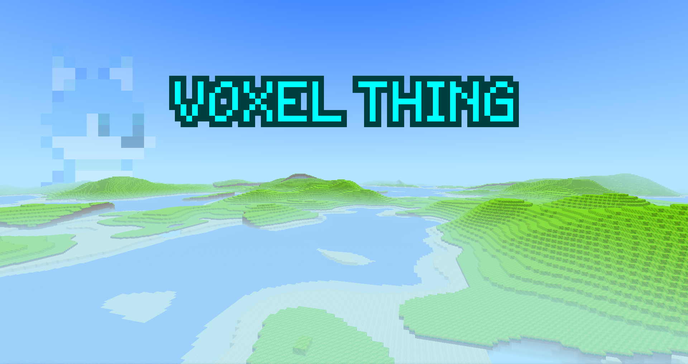

    

        
    

Voxel Thing is a work-in-progress clone of a really popular block game that will be focused on extensive customisability.
There is not much to this game yet, but feel free to contribute!

## Controls
- WASD: Fly around
- Move mouse: Look around
- Space: Jump
- Double Space: Fly
- Shift: Fly down
- 1-9: Select block
- Left click: Place block
- Right click: Break block
- E: Inventory
- Q: No-clip
- R: Teleport to a random position
- F1: Toggle GUI
- F3: Debug menu
- F4: Toggle profiler (debug mode only)
- F5: Toggle third person
- Escape: Open pause menu

## Play
Compiled binaries for the C# port of Voxel Thing are available in Github Actions.
A Github account is required to download them and .NET 8+ runtime is required to run them.
The executables in the artifacts are made for Linux, but on Windows and Mac the game can be run by opening a command prompt in the same directory as the executable and running the command `dotnet ./VoxelThing.Client.dll`.
If you don't have a Github account, you can compile the game yourself instead.

## Compiling
To compile Voxel Thing, simply run `dotnet build`. .NET 8+ SDK is required.
The resulting executable can be found in `VoxelThing.Client/bin/Debug/net8.0`.
For better performance, build with the release configuration by running `dotnet build -c Release`.
